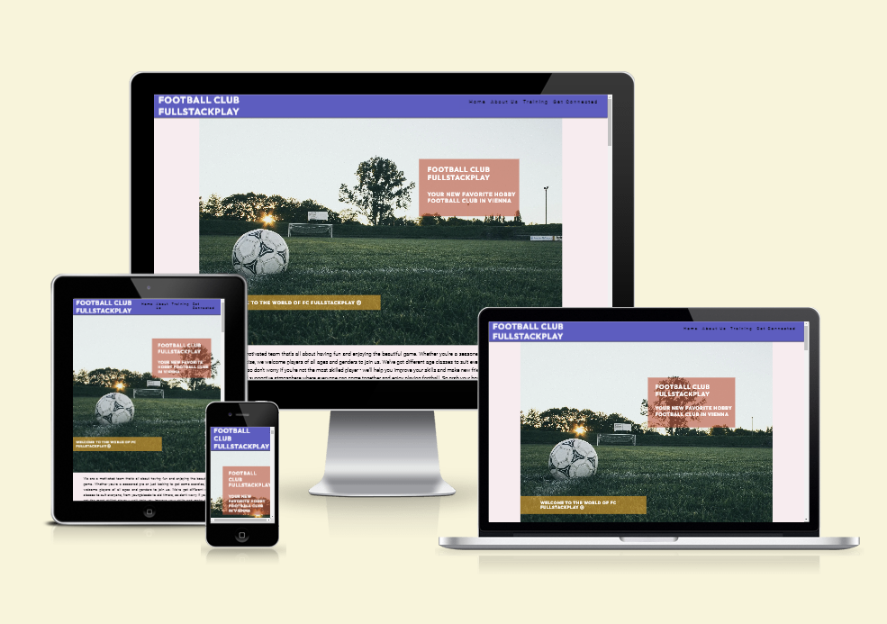

# Football Club FullStackPlay

Visit the deployed site: [Football Club FullStackPlay](https://florians4.github.io/project-1-soccer/)

Football Club FullStackPlay is a 

## Content
- [Site Owner Goals](#site-owner-goals)
- [User Experience](#user-experience)
    - [User Stories](#user-stories)
        - [First Time User](#first-time-user)
        - [Returning User](#returning-user)
        - [Frequent User](#frequent-user)
- [Design](#design)
    - [Typography](#typography)
    - [Imagery](#imagery)
    - [Color Scheme](#color-scheme)
- [Wireframes](#wireframes)
- [Features](#features)
    - [Navigation Bar](#navigation-bar)
    - [Hero Image](#hero-image)
    - [Contentpart Home](#contentpart-home)
        - [Image Gallery](#image-gallery)
    - [Contentpart About Us](#contentpart-about-us)
        - [Timeline](#timeline)
        - [Participations](#participations)
        - [Hear from our Members](#hear-from-our-members)
    - [Contentpart Training](#contentpart-training)
        - [Schedule Table](#schedule-table)
    - [Contentpart Get Connected](#contentpart-get-connected)
        - [Address Block](#address-block)
        - [Google Iframe](#google-iframe)
        - [Sig Up Form](#sign-up-form)
    - [Footer](#footer)
    - [Testing](#testing)
        - [Validator Testing](#validator-testing)
            - [HTML](#html)
            - [CSS](#css)
        - [Accessibility](#accessibility)
            - [Lighthouse Testing](#lighthouse-testing)
            - [Wave Testing](#wave-testing)
        - [Links Testing](#links-testing)
        - [Form Testing](#form-testing)
        - [Browser Testing](#browser-testing)
        - [Device Testing](#device-testing)
    - [Technologies Used](#technologies-used)
        - [Languages](#languages)
        - [Programs Used - Frameworks - Libraries](#programs-used---frameworks---libraries)
    - [Deployment](#deployment)
    - [Credits](#credits)
        - [Content](#content)
        - [Resources Used](#resources-used)
        - [Media](#media)
    - [Acknowledgments](#acknowledgments)

## Site Owner Goals

## User Experience
### User Stories
#### First Time User
#### Returning User
#### Frequent User

## Design
### Typography
### Imagery
### Color Scheme

## Wireframes

## Features
### Navigation Bar
### Hero Image
### Contentpart Home
#### Image Gallery
### Contentpart About Us
#### Timeline
#### Participations
#### Hear from our Members
### Contentpart Training
#### Schedule Table
### Contentpart Get Connected
#### Address Block
#### Google Iframe
#### Sign up Form
### Footer

## Testing
### Validator Testing
#### HTML
#### CSS
### Accessibility
#### Lighthouse Testing
#### Wave Testing
### Links Testing
### Form Testing
### Browser Testing
### Device Testing

## Technologies Used
### Languages
### Programs Used - Frameworks - Libraries

## Deployment

## Credits
### Content
### Resources Used
### Media

## Acknowledgments
