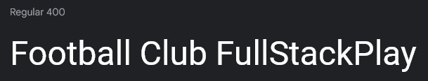
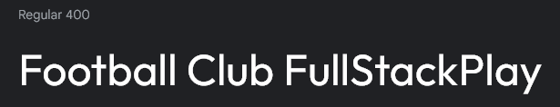
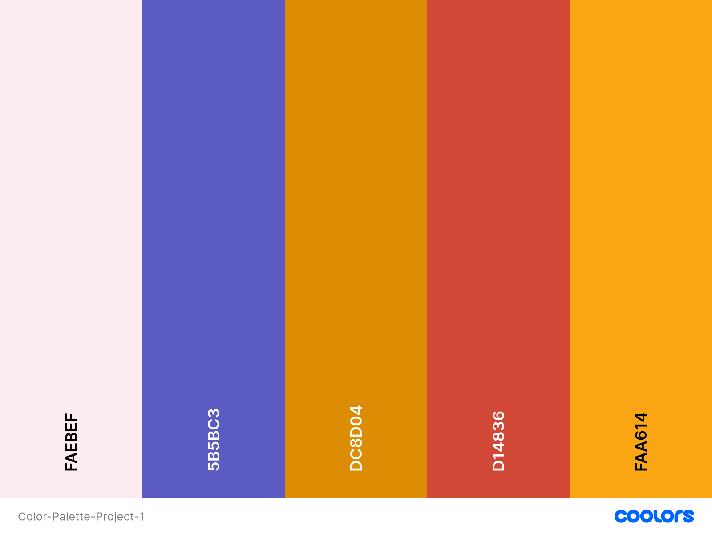

# Football Club FullStackPlay

Visit the deployed site: [Football Club FullStackPlay](https://florians4.github.io/project-1-soccer/)

Football Club FullStackPlay is a 

## Content
- [Site Owner Goals](#site-owner-goals)
- [User Experience](#user-experience)
    - [User Stories](#user-stories)
        - [First Time User](#first-time-user)
        - [Returning User](#returning-user)
        - [Frequent User](#frequent-user)
- [Design](#design)
    - [Typography](#typography)
    - [Imagery](#imagery)
    - [Color Scheme](#color-scheme)
- [Wireframes](#wireframes)
- [Features](#features)
    - [Favicon](#favicon)
    - [Navigation Bar](#navigation-bar)
    - [Hero Image](#hero-image)
    - [Contentpart Home](#contentpart-home)
        - [Image Gallery](#image-gallery)
    - [Contentpart About Us](#contentpart-about-us)
        - [Timeline](#timeline)
        - [Participations](#participations)
        - [Hear from our Members](#hear-from-our-members)
    - [Contentpart Training](#contentpart-training)
        - [Schedule Table](#schedule-table)
    - [Contentpart Get Connected](#contentpart-get-connected)
        - [Address Block](#address-block)
        - [Google Iframe](#google-iframe)
        - [Sig Up Form](#sign-up-form)
    - [Footer](#footer)
    - [Testing](#testing)
        - [Validator Testing](#validator-testing)
            - [HTML](#html)
            - [CSS](#css)
        - [Accessibility](#accessibility)
            - [Lighthouse Testing](#lighthouse-testing)
            - [Wave Testing](#wave-testing)
        - [Links Testing](#links-testing)
        - [Form Testing](#form-testing)
        - [Browser Testing](#browser-testing)
        - [Device Testing](#device-testing)
    - [Technologies Used](#technologies-used)
        - [Languages](#languages)
        - [Programs Used - Frameworks - Libraries](#programs-used---frameworks---libraries)
    - [Deployment](#deployment)
    - [Credits](#credits)
        - [Content](#content)
        - [Resources Used](#resources-used)
        - [Media](#media)
    - [Acknowledgments](#acknowledgments)

## Site Owner Goals
- to provide the user with a site about an football club in Vienna.
- to provide the user with informations about this club and how to join.
- to provide the user with a short overview what to expect from other members, if they join.
- to provide the user with a overview of possibable dates to join a training or watch a match.
- to offer an address and a way to get in contact with the club.
- to provide the user with the location information of the football club.
- to offer a signup form for a newsletter for different age classes.

## User Experience
### User Stories
#### First Time User
- I want the main purpose of the website to be easy to understand and easy to navigate.
- I want the site to be responsive to my device.
- I want to know about the cost and what age range football activities are played.
- I want to know how to get in contact with the club and where to find it.
- I want to read about already enrolled members and what they think about the club.
#### Returning User
 - I want to find future training dates for my or my childs age range.
 - I want to subscribe to the newsletter to find out about club activities where I could participate.
#### Frequent User
- I want to find out about results from different teams of the club.
- I want to find out when i could watch a match live.

## Design
### Typography

[Google Fonts](https://fonts.google.com/) was used for the following fonts:
- 
[Roboto](https://fonts.google.com/specimen/Roboto?query=Roboto) was chosen for the main body, because it was easy to read and has a good correlation to 
- 
[Outfit](https://fonts.google.com/specimen/Outfit?query=Outfit) which i choose for my Headings.
- Sans Serif was chosen as a backup font, in case the main font is not imported into the website, or there is a problem with the browser.

### Imagery

All Images were taken from pexels.com and unsplash.com. I give credit to them in the [credits](#credits) section. All images are free stock photos. The images selected show kids, woman and men playing soccer.

### Color Scheme

A skincolor variation was used as the background-color for the main body. Slate Blue was used for the Header and Footer. I used two different orange colors for the headings #FAA614 was used for the 1st Heading and #DC8D04 for the remaining heading and suvheadings. The reason for that was, that #FAA614 didn't look good on the Hero Image.
For the cover text of the hero image i used red, because i gave a good contrast to the green of the hero image.

## Wireframes

## Features
### Favicon
### Navigation Bar
picture of the navbar!!!!
- The navbar includes the name of the club and the menu. The menu consists of Home, About Us, Training and Get Connected. These items are links to different parts inside the site.
- The navbar is fixed at the top so it stays visible while scrolling the page and gives the user the ability to navigate freely to other sections, or back to the top.
- When selecting the Club Name the user will also go back to the top of the page.

Picture of hover function of the page !!!
- When hovering over the different points in the section, they will change the color to indicate which one the user is hovering.

Picture of navbar on mobile
- On smaller screens the menu items are replaced by a burger-menu-icon with dropdown function.
### Hero Image
Picture of the Hero Image!!!
- The Hero Image consist of a background picture with a cover text on top.
- The cover text moves depending on the screen size.
- On the bottom of the Hero Image is the first Heading of the page.
- Both text fields have a transparent look, so the Hero Image is still visable.
### Contentpart Home
- The first content part is just a little text about the club, a little intro.
#### Image Gallery
Picture of the image gallery!!!
- consist of 6 pictures that shows players of the club. From children to Woman and Men, so it represents the different age ranges that are represent in the club.

Picture of the image gallery in different screen sizes!!
- depeding on the screen size, the image gallery response. On small screens in has 3 rows to 2 pictures. 
- On big screens it has 2 Rows to 2 pictures
### Contentpart About Us 
#### Timeline
- The About Us section contains 3 different parts.
    - A timeline of the founding history and iportant dates for the club
#### Participations
- recent activities with links to the different winnings or tournaments
#### Hear from our Members
- A Hear from our Members section with pictures and short messages about the club form said members.
### Contentpart Training
#### Schedule Table
- a schedule table with all training and matches taking place during the week.
- gekennzeichnet with different colors, for easier visibilaty
### Contentpart Get Connected
#### Address Block
picture of the address block!!
- a address block with contact informations
#### Google Iframe
picture of the google maps !!
- a google maps image with the location of the football stadium
#### Sign up Form
picture of the sign up form!!
a sign up form for a newsletter to get infos about the club and activities
### Footer
picutre of the footer!!
- a footer with links to different social media pages.

## Testing
### Validator Testing
#### HTML
#### CSS
### Accessibility
#### Lighthouse Testing
#### Wave Testing
### Links Testing
### Form Testing
### Browser Testing
### Device Testing

## Technologies Used
### Languages
### Programs Used - Frameworks - Libraries

## Deployment

## Credits
### Content
### Resources Used
### Media

## Acknowledgments
