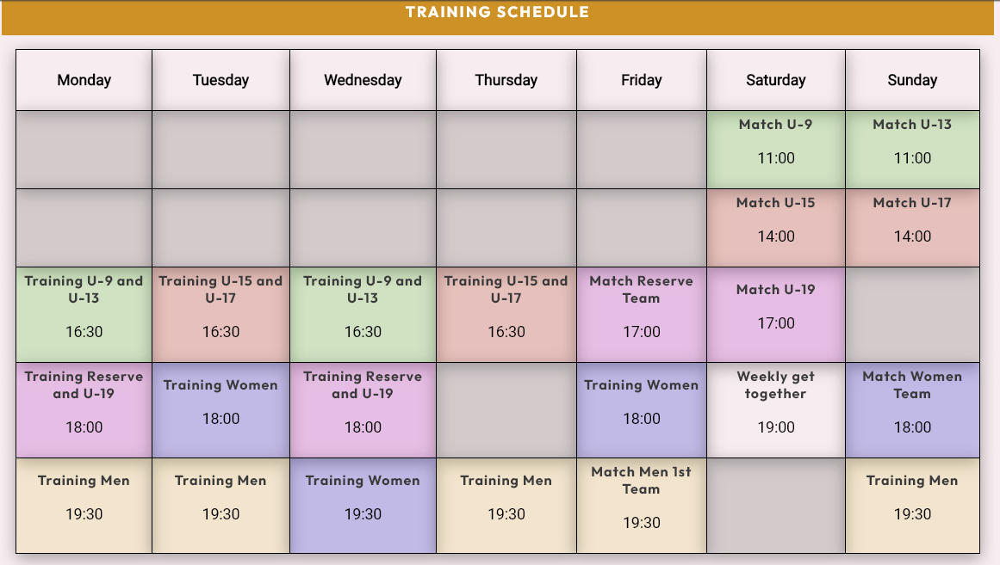
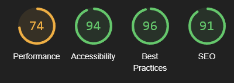

# Football Club FullStackPlay

Visit the deployed site: [Football Club FullStackPlay](https://florians4.github.io/project-1-soccer/)

Football Club FullStackPlay is a 

## Content
- [Site Owner Goals](#site-owner-goals)
- [User Experience](#user-experience)
    - [User Stories](#user-stories)
        - [First Time User](#first-time-user)
        - [Returning User](#returning-user)
        - [Frequent User](#frequent-user)
- [Design](#design)
    - [Typography](#typography)
    - [Imagery](#imagery)
    - [Color Scheme](#color-scheme)
- [Wireframes](#wireframes)
- [Features](#features)
    - [Favicon](#favicon)
    - [Navigation Bar](#navigation-bar)
    - [Hero Image](#hero-image)
    - [Contentpart Home](#contentpart-home)
        - [Image Gallery](#image-gallery)
    - [Contentpart About Us](#contentpart-about-us)
        - [Timeline](#timeline)
        - [Participations](#participations)
        - [Hear from our Members](#hear-from-our-members)
    - [Contentpart Training](#contentpart-training)
        - [Schedule Table](#schedule-table)
    - [Contentpart Get Connected](#contentpart-get-connected)
        - [Address Block](#address-block)
        - [Google Iframe](#google-iframe)
        - [Sig Up Form](#sign-up-form)
    - [Footer](#footer)
- [Testing](#testing)
    - [Validator Testing](#validator-testing)
        - [HTML](#html)
        - [CSS](#css)
    - [Accessibility](#accessibility)
        - [Lighthouse Testing](#lighthouse-testing)
        - [Wave Testing](#wave-testing)
    - [Links Testing](#links-testing)
    - [Form Testing](#form-testing)
    - [Browser Testing](#browser-testing)
    - [Device Testing](#device-testing)
- [Technologies Used](#technologies-used)
    - [Languages](#languages)
    - [Programs Used - Frameworks - Libraries](#programs-used---frameworks---libraries)
- [Deployment](#deployment)
- [Credits](#credits)
    - [Content](#content)
    - [Resources Used](#resources-used)
    - [Media](#media)
- [Acknowledgments](#acknowledgments)

## Site Owner Goals
- to provide the user with a website about a football club in Vienna.
- to provide the user with information about this club and how to join.
- to provide the user with a short overview of the experience from other members, if they join.
- to provide the user with a overview of possible training times and match times.
- to offer an address and a way to get in contact with the club.
- to provide the user with the location information of the football club.
- to offer a signup form for a newsletter for different age classes.

## User Experience
### User Stories
#### First Time User
- I want the main purpose of the website to be easy to understand and to navigate.
- I want the site to be responsive to my device.
- I want to know about the cost of becoming a member and in what age range football activities are played.
- I want to know how to get in contact with the club and where to find it.
- I want to read about already enrolled members' experience and what they think about the club.
#### Returning User
 - I want to find future training dates for me or my children's age range.
 - I want to subscribe to the newsletter to find out about club activities where I could participate.
#### Frequent User
- I want to subscribe to the newsletter to find out about club activities and how I could participate.
- I want to find out when matches are held, so I could watch a match live.

## Design
### Typography

[Google Fonts](https://fonts.google.com/) was used for the following fonts:
- 
[Roboto](https://fonts.google.com/specimen/Roboto?query=Roboto) was chosen for the main body, because it was easy to read and has a good correlation to the following:
- 
[Outfit](https://fonts.google.com/specimen/Outfit?query=Outfit) which I choose for my Headings.
- Sans Serif was chosen as a backup font, in case the main font is not imported into the website, or there is a problem with the browser.

### Imagery

All Images were taken from pexels.com and unsplash.com. I give credit to them in the [credits](#credits) section. All images are free stock photos. The images selected show kids, woman and men playing soccer.

### Color Scheme

For the main body a fair beige color was used. Slate Blue was used for the Header and Footer. I used two different orange tones for the heading-section's background. #FAA614 was used for the 1st Heading and #DC8D04 for the remaining headings and subheadings. I chose two different background colors for the heading as one heading was on top of the hero image and #FAA614 didn't look good on the Hero Image. For the cover text of the hero image I used red, because I gave a good contrast to the green of the hero image.
In general, I chose these colors as they are typical football colors, that are generally in contrast to one another as well as easily to detect on a football court. The colors are meant to represent the colors of the team. I decided that these colors are easy identify on a website as well as when playing the sport.

## Wireframes

## Features
### Favicon

### Navigation Bar

- The navbar consists of the name of the club and the menu. The menu includes Home, About Us, Training and Get Connected parts. When clicking each part they link to the different according parts on the page.
- The navbar is at the top of the paged and fixated so it stays visible while scrolling down the page and gives the user the ability to navigate freely to other sections, or back to the top.
- When selecting the Club Name the user will also go back to the top of the page.

- While hovering over the different parts of the menu, the according part will change to a white color to indicate to the user that it is for something different.

- On mobile devices ( and other smaller screens) instead of the menu parts, a menu-icon (commonly used burger menu favicon) with is shown. When clicking on this a drop-down menu with the different menu parts is shown.
### Hero Image

- The Hero Image consist of a background picture with a cover text on top.
- The cover text moves depending on the screen size.
- On the bottom of the Hero Image is the first Heading of the page to start going further into detail about the website. I chose this so the user will be fluently led from the image and the name of the club to what the club is about.
- Both text fields have a semi-transparent look, so the Hero Image is still visible, while still highlighting the text parts.
### Contentpart Home
- The first content part is just a little text about the club, to give the user basic information about the club in a short and precise way. I chose to do it this way to not put too much focus away from other topics below and still keeping the user engaged. 
#### Image Gallery

- this part consists of 6 pictures that show players of the club while they are playing football. From children to adults, women to men, these pictures represent the different age ranges that are represent in the club. They are meant to visualize different things the club is doing to the user.

- depending on the screen size, the image gallery is responsive. On small screens it therefore has 3 rows of each 2 pictures.
- On bigger screens it has 2 Rows of each 3 pictures.
### Contentpart About Us 
- The About Us section contains 3 different parts.
#### Timeline

- A timeline of the founding history of our different teams and important dates for the club. I chose this to give the user general understanding about important milestones of the club.
- I wasn't able to propably come up with a timeline style-code myself. Therefore I looked various code up and decided on the code from w3schools. More information about this you will find in the [credits](#credits).
#### Participations

- this part shows recent activities with links to the different tournaments and victories. The user can click on further information about either tournaments (will open external link in second tab) or for the summer camp they are directed to the sign up from for the newsletter:
#### Hear from our Members

- A "hear from our Members" section with pictures of four members, who they are and short messages about the club form said members.
- This shows the user again real life experience from club members and functions as reviews.
- On mobile devices the text is presented under the picture,

 for bigger screens the name and who that person is is only shown when the mouse cursor hovers over it.

### Contentpart Training
#### Schedule Table

- a schedule table with all training- and match-times taking place during the week. I chose a table, because it is easy to understand for every age group and most people are familiar with the format.
- training times for the same teams/groups have the same color. This is for easier visibility to identify each course.
- on mobile screens/smaller screens the responsiveness is given through a horizontal scrolling bar.
-below this table there is a short text about the occurring yearly membership costs.
### Contentpart Get Connected
#### Address Block

- an address block with contact information in a basic design. This gives the user various ways of getting in contact with the club.
#### Google Iframe
- a google maps image embedded from google directly to keep the now Google Maps visuals. The user will easily find out the location of the football stadium.
#### Sign up Form

- a simple sign up form for a newsletter to get information about the club and activities. The user can chose for which ager range he or she wants to be informed about.

- a color changing Sign up button when hovering over it. To show the user that threw this the data will be sumbitted.
### Footer

- a footer with links to different social media pages. They all open in a new tab and use commonly known icons for each social media platform.

## Testing
### Validator Testing
#### HTML
The HTML validator test on [Validator.w3](https://validator.w3.org/) is showing a warning on line 66 of the HTML document. The reason for that is that a section is lacking a heading. Considering, that that section doesn't need a heading, i ignored the warning.
- [Index.HTML -validator result](https://validator.w3.org/nu/?doc=https%3A%2F%2Fflorians4.github.io%2Fproject-1-soccer%2F)
#### CSS
No errors were shown for the CSS stylsheet from the W3C CSS Validator
- [styles.css - validator result](https://jigsaw.w3.org/css-validator/validator?uri=https%3A%2F%2Fflorians4.github.io%2Fproject-1-soccer%2F&profile=css3svg&usermedium=all&warning=1&vextwarning=&lang=en)
### Accessibility
#### Lighthouse Testing
Desktop

Mobile

#### Wave Testing

### Links Testing
- All internal links are working correctly and redirecting to the correct sections.
- All external links are working correctly and redirecting the user to the external website in a separated tab.
### Form Testing
The form has been successfully tested. It shows an error message if wrong or no data is entered. In case of an e-mail address the form demands an @ symbol or otherwise it will show an error message. 
### Browser Testing
The website was successfully tested on the following browsers:
- Google Chrome
- Safari
### Device Testing
- The webiste was tested on different devices. 
    - Smartphones (Iphone Xr, )
    - Laptops
    - Desktop PCs
## Technologies Used
### Languages
HTML, CSS
### Programs Used - Frameworks - Libraries

## Deployment

## Credits
### Content
### Resources Used
### Media

## Acknowledgments
