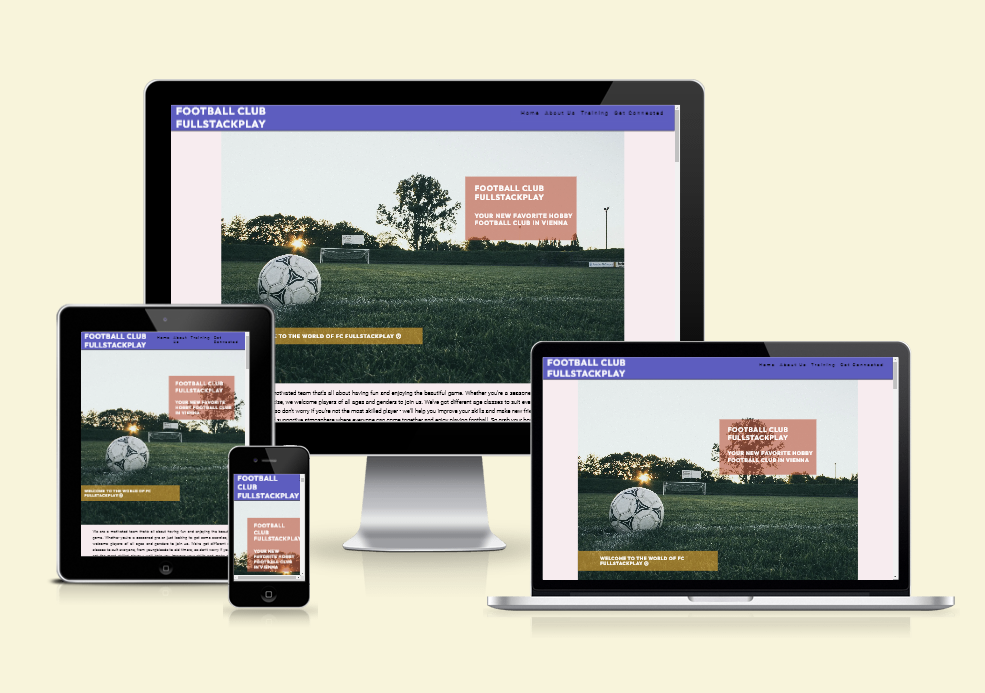
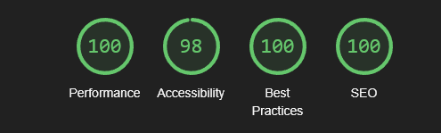
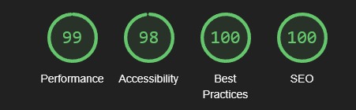
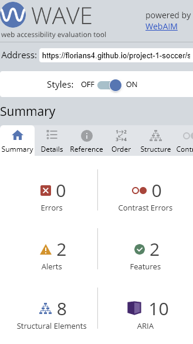

# Football Club FullStackPlay - Testing

Visit the deployed site: [Football Club FullStackPlay](https://florians4.github.io/project-1-soccer/)

## Content
- [Validator Testing](#validator-testing)
        - [HTML](#html)
        - [CSS](#css)
- [Accessibility](#accessibility)
        - [Lighthouse Testing](#lighthouse-testing)
        - [Wave Testing](#wave-testing)
- [Links Testing](#links-testing)
- [Form Testing](#form-testing)
- [Browser Testing](#browser-testing)
- [Device Testing](#device-testing)
- [User Testing](#user-testing)
- [Manual Testing](#manual-testing)

### Validator Testing
#### HTML
The HTML validator test on [Validator.w3](https://validator.w3.org/) is showing a warning on line 66 of the HTML document. The reason for that is that a section is lacking a heading. Considering, that that section doesn't need a heading, I ignored the warning.
- [Index.HTML -validator result](https://validator.w3.org/nu/?doc=https%3A%2F%2Fflorians4.github.io%2Fproject-1-soccer%2Findex.html)
- [Sign-up-form.HTML - validator result](https://validator.w3.org/nu/?doc=https%3A%2F%2Fflorians4.github.io%2Fproject-1-soccer%2Fsign-up-form.html%3Ffirstname%3DFlorian%26lastname%3DSassmann%26email-address%3Dflor%2540gmail.com%26age%3Dall-ages)
#### CSS
No errors were shown for the CSS stylesheet from the W3C CSS Validator
- [styles.css - validator result](https://jigsaw.w3.org/css-validator/validator?uri=https%3A%2F%2Fflorians4.github.io%2Fproject-1-soccer%2F&profile=css3svg&usermedium=all&warning=1&vextwarning=&lang=en)
### Accessibility
#### Lighthouse Testing
Desktop

- Main Page 

- Sign Up Page

Mobile

- Main Page

- Sign Up Page

#### Wave Testing
Wave testing on main page

Wave testing on sign up page

### Links Testing
- All internal links are working correctly and redirecting to the correct sections.
- All external links are working correctly and redirecting the user to the external website in a separated tab.
### Form Testing
The form has been successfully tested. It shows an error message if wrong or no data is entered. In case of an e-mail address the form demands an @ symbol or otherwise it will show an error message.
### Browser Testing
The website was successfully tested on the following browsers:
- Google Chrome
- Safari
- Mozilla Firefox
### Device Testing
- The website was tested on different devices. 
    - Smartphones (Iphone Xr, Samsung Galaxy S2, Iphone 8, Iphone 11 Pro, Ipad Pro 11", Huawei P40 Pro)
    - Laptops
    - Desktop PCs
### User Testing

First Time User:
- I want the main purpose of the website to be easy to understand and to navigate.

        The website layout is structured so it is user friendly, with a common and easy to understand layout. The user can understand the purpose of the website without having to look deeply into it.

- I want the site to be responsive to my device.

        The website was made completely responsive for all devices and screen sizes.

- I want to know about the cost of becoming a member and in what age range football activities are played.

        The website has a membership text-element with information about the price under the training schedule. The training schedule itself shows age ranges. What is more in the picture the user can see different ages and in the texts different age ranges are mentioned as well.

- I want to know how to get in contact with the club and where to find it.

        You can contact the club via phone or email. The contact information is found in the address block above the google map.

- I want to read about already enrolled members' experience and what they think about the club.

        The website has a short section with statements from different types of members and how they feel about the club. 

Returning User:
- I want to find future training dates for me or my children's age range.

        In the training section is a schedule table with a timetable for the different training units, but it is best to contact the club first or sign up for the newsletter, before showing up.

- I want to subscribe to the newsletter to find out about club activities where I could participate.

        The website has a Sign Up form at the bottom of the page. 

Frequent User:
- I want to subscribe to the newsletter to find out about club activities and how I could participate.

        The website has a Sign Up form at the bottom of the page.

- I want to find out when matches are held, so I could watch a match live.

        The user can see the upcoming matches in the schedule table which is regularly updated.

### Manual Testing

- Main Page 

| Feature | Expected Outcome | Testing Performed | Result | Pass/Fail |
| --- | --- | --- | --- | --- |
| Website title | Always returns user to top of the page | Clicked title | Returns to top of the page| Pass |
| Menu items | Link to different sections on the page | Clicked item | Jumps to different parts of the page | Pass |
| In recent activities links to external websites | Open website in new tab | Clicked link | Opens website in new tab | Pass |
| Last recent activities link directs to sign up form | Jumps down to sign up form | Clicked link | Jumps down to sign up form | Pass |
| Hover function in Hear from our Members section | Hovering over portrait pictures shows name and title of member | Hovering over portrait | Shows name and title | Pass |
| Google maps iframe | Functions of iframe work according to google standards | Clicking google maps section | Functions work accordingly | Pass |
| Sign up form - Input elements | Shows error message when wrong data is committed | Filled in wrong or none data | Error message shows up | Pass |
|Sign up form - Sign up button | Pressing sign up button opens new page with message | Pressing sign up button | Opens new page | Pass |
|Social media icons - links | Pressing icon opens according social media page in external tab | Clicking icon | Opens social media page in external tab | Pass |

- Sign up Page

| Feature | Expected Outcome | Testing Performed | Result | Pass/Fail |
| --- | --- | --- | --- | --- |
| Website title | Always returns user to top of the main page | Clicked title | Returns to top of the main page| Pass |
| Home item | Link to top of main page | Clicked home | Jumps to top of main page | Pass |
|Social media icons - links | Pressing icon opens according social media page in external tab | Clicking icon | Opens social media page in external tab | Pass |

I also used following sides to test responsiveness
- [Responsinator](http://www.responsinator.com/?url=https%3A%2F%2Fflorians4.github.io%2Fproject-1-soccer%2F)
- [Am I Responsive](https://ui.dev/amiresponsive?url=https://florians4.github.io/project-1-soccer/)